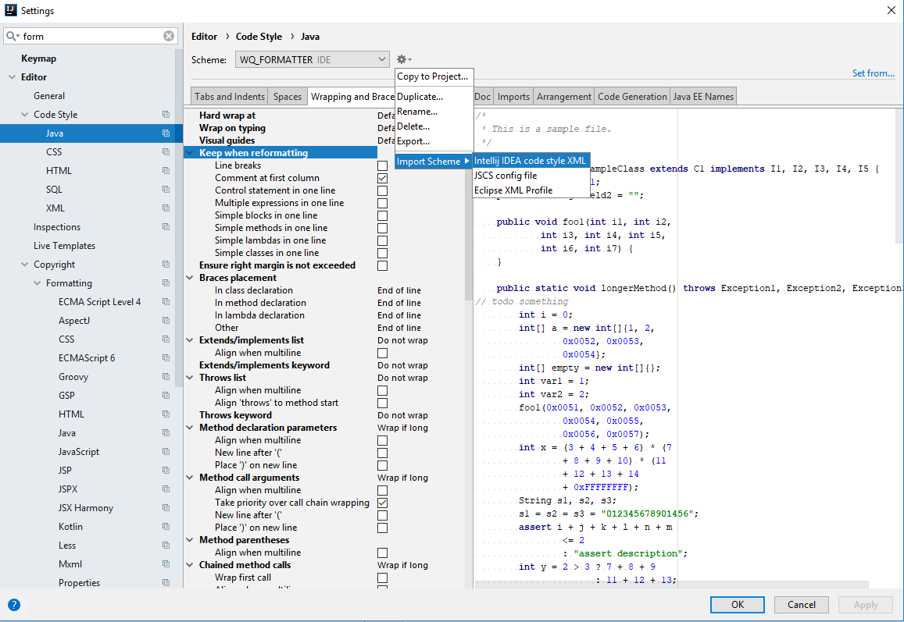
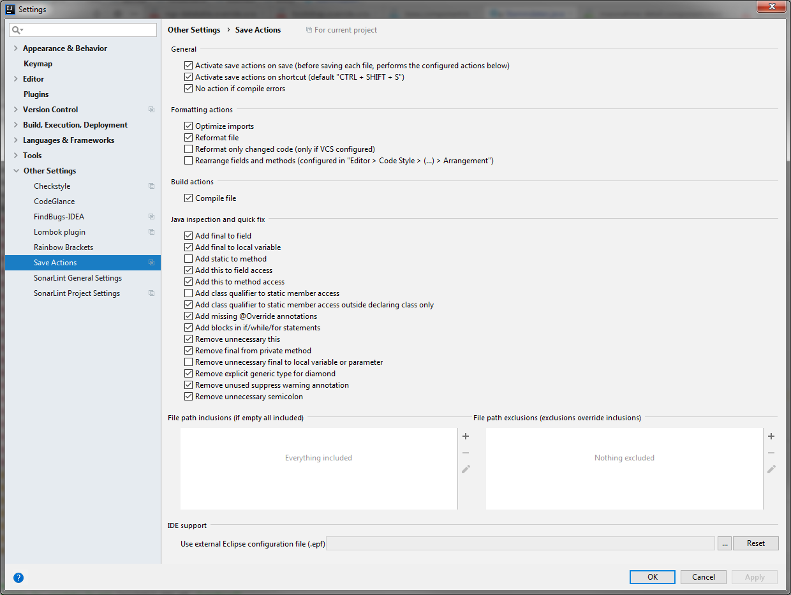

## coding-guidelines

Formatter, Checkstyle etc. für das Beta-Team

### Installation Java-Formatter IntelliJ
Um den Java-Formatter zu installieren, muss lediglich der beta_team_intellij_java_formatter.xml in Intellij eingetragen werden.


Mittels @formatter:off und folgendem @formatter:on können bestimmte Bereiche im Code von der Formatierung ausgenommen werden.
```
export enum StammdatenKategorie {
    //@formatter:off
    AKTIONSTYP = <any> 'Aktionstyp',
    BAUREIHE = <any> 'Baureihe',
    VERKAEUFERPROVISION = <any> 'Verkäuferprovision',
    MODELLKATEGORIE = <any> 'Modellkategorie',
    MODELL = <any> 'Modell'
    //@formatter:on
}
```

### Save-Actions
Plugin https://plugins.jetbrains.com/plugin/7642-save-actions installieren und mit den folgenden Optionen konfigurieren:


### Linting
Die tslint.json dieses Repositories enthält die Regel-Definitionen für das Linting. Damit diese berücksichtigt werden, muss in der tslint.json des Angular-Artefakts folgender Inhalt eingetragen sein:
```
{
  "rulesDirectory": [
    "node_modules/codelyzer"
  ],
  "extends": [
    "../../../../config/tslint.json"
  ]
}
```
In der package.json müssen im Bereich "devDependencies" folgende Einträge für die Linting Modules enthalten sein:
```
"devDependencies": {
  "codelyzer": "4.4.2",
  "tslint": "5.10.0",
  "tslint-sonarts": "1.7.0"
}
```